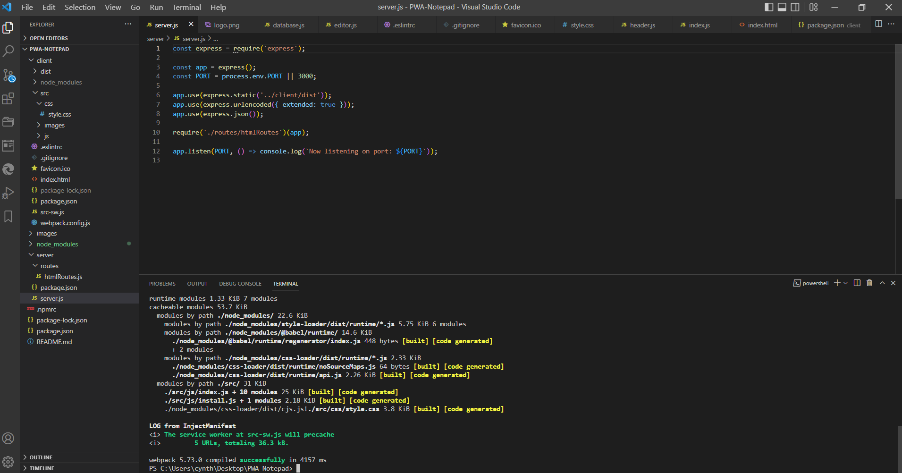

# Progressive Web Applications (PWA): Notepad

## Description

Notepad is a **Progressive Web Application (PWA)** text editor that runs in the browser. It is a single-page application that features a number of data persistence techniques that serve as a redundancy in case one of the options is not supported by a specific browser. The application also functions offline. The app uses a package called `idb`, which is a lightweight wrapper around the IndexedDB API. It features a number of methods that are useful for storing and retrieving data, and are used by companies like Google and Mozilla. 

The application will be launched with Heroku using the [Heroku Deployment Guide on The Full-Stack Blog](https://coding-boot-camp.github.io/full-stack/heroku/heroku-deployment-guide).

## Installation
To install all of the Webpacks for the application you can either copy the package.json files in both the Server & Client side and run `npm install` or each item can be installed individually if you are starting from scratch. `npm run build` creates the `dist` folder.

* [Webpack Dev Server](https://www.npmjs.com/package/webpack-dev-server)
* [Webpack Mode Production](https://webpack.js.org/configuration/mode/)
* [Webpack Watch](https://www.npmjs.com/package/webpack-watch-files-plugin)
* [Babel Core](https://www.npmjs.com/package/@babel/core)
* [Babel Runtime](https://babeljs.io/docs/en/babel-plugin-transform-runtime)
* [Babel Preset](https://babeljs.io/docs/en/babel-preset-env)
* [Babel Loader](https://www.npmjs.com/package/babel-loader)
* [CSS Loader](https://www.npmjs.com/package/css-loader)
* [HTML webpack plugin](https://www.npmjs.com/package/html-webpack-plugin)
* [Http Server](https://www.npmjs.com/package/http-server)
* [Style Loader](https://webpack.js.org/loaders/style-loader/)
* [Webpack](https://www.npmjs.com/package/webpack)
* [Webpack CLI](https://www.npmjs.com/package/webpack-cli)
* [Webpack Dev Server](https://webpack.js.org/configuration/dev-server/)
* [Webpack Manifest](https://www.npmjs.com/package/webpack-manifest-plugin)
* [Workbox Webpack plugin](https://www.npmjs.com/package/workbox-webpack-plugin)
* [CSS Mini](https://webpack.js.org/plugins/mini-css-extract-plugin/#getting-started)
* [Code Mirror](https://www.npmjs.com/package/codemirror)
* [idb](https://www.npmjs.com/package/idb)
* [Express](https://www.npmjs.com/package/express)
* [Nodemon](https://www.npmjs.com/package/nodemon)

## Usage
This application has been launched onto Heroku for the font-end user. As a fullstack developer, the following commands can be entered into the command line:

1. To start client and server start
```
npm run start
```

2. To run the build script and start the server
```
npm run start:prod
```

3. To have the server start without the client
```
npm run server
```

4. To have the client run the webpack build script
```
npm run build
```

5. To have the client's dependencies installed
```
npm run install
```

6. To have the client start without the server
```
npm run client
```

## Items Completed

✅ An text editor web applicaiton with a Client Server Folder Structure.

✅ `npm run start` from root directory starts-up the backend and serves the client and app can be ran from the terminal.

✅ Javascript files have been bundled using webpack, and when the webpack plugins are run HTML file, service worker, and manifest file are generated.

✅ Next-gen Javascript was used in application

✅ Application still functions in browser without errors.

✅ IndexedDB created a database storage. Content is entered to click off DOM window and is saved with indexedDB. After closing and reopening the content can be retrieved from IndexedDB.

✅ When the application Install button is the clicked the web application is downloaded as a web application icon on the desktop.

✅ There is a registered service worker using workbox.

✅ Static assests are pre cached upon loading along with subsequent pages and static assets.

✅ Application is Deployed to Heroku

✅ There are the proper build scripts for a webpack application.

## Screenshot


